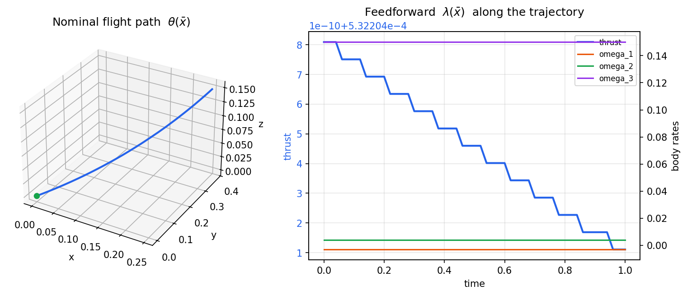
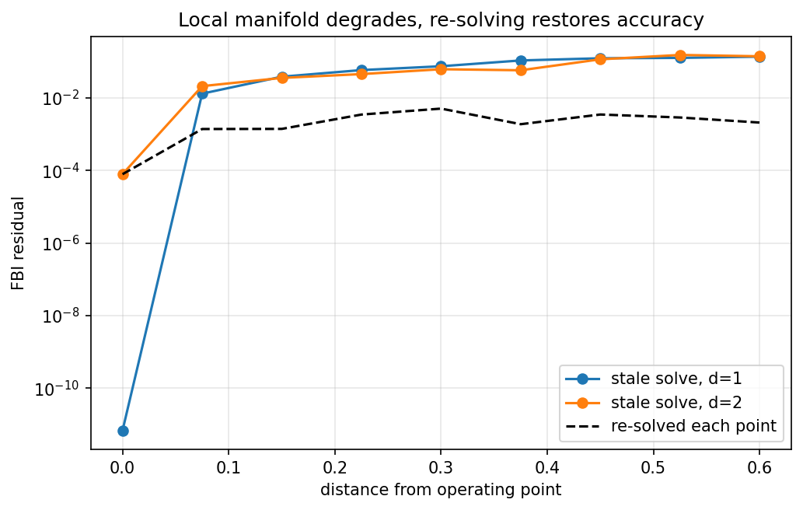
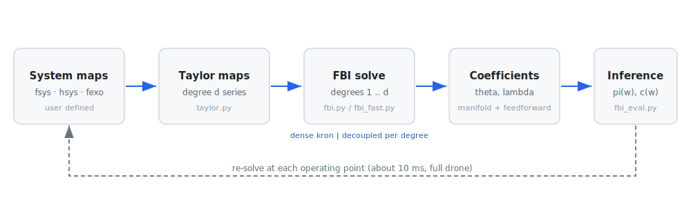
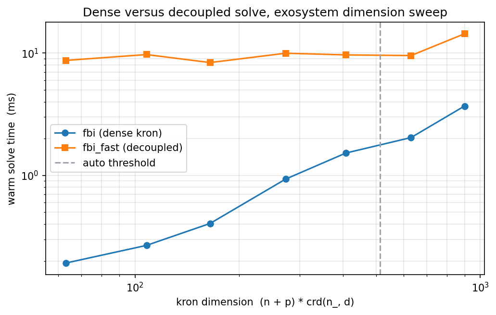
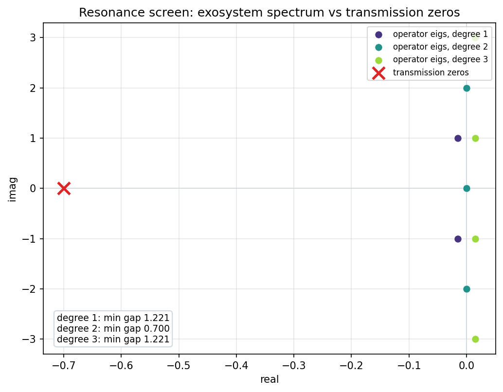
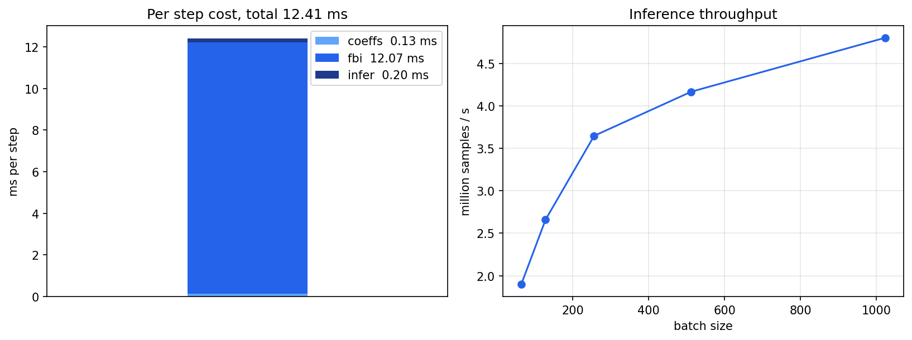
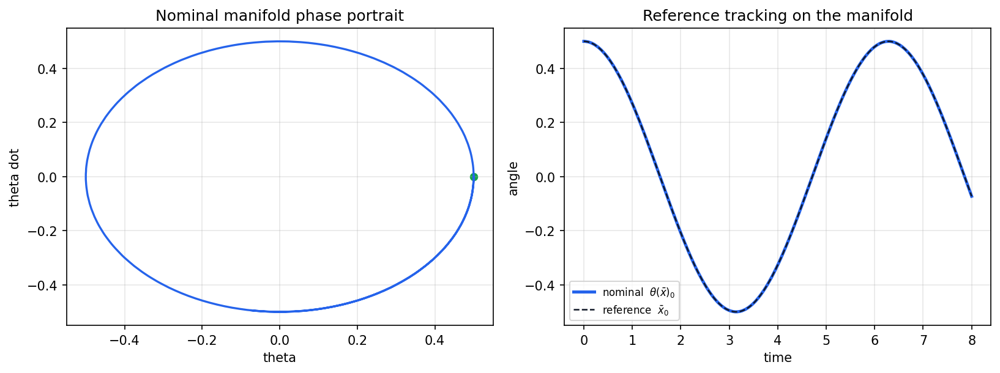
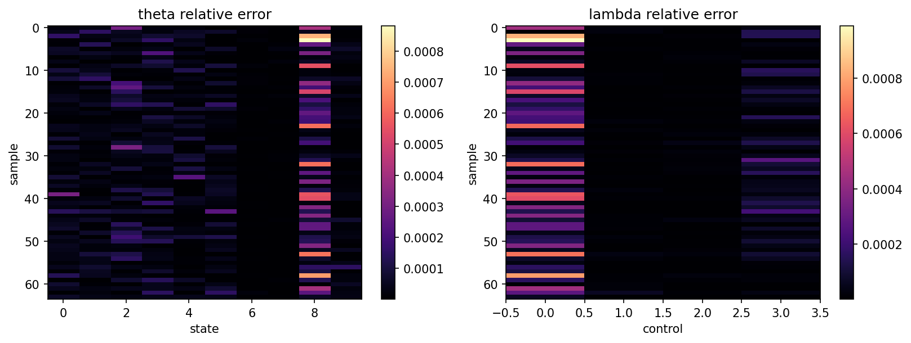

# A JAX based independent reimplementation of the control suite from Nonlinear Systems Toolbox by Professor A.J. Krener

Please note that this is not intended to copy the original MATLAB suite one-to-one. The original toolbox can be obtained from https://www.math.ucdavis.edu/~krener/nst08.zip

I intend to implement the HJB and FBI algorithms and the necessary helper functions for the same. Currently only **FBIJAX** is implemented.

The entire project is divided into two parts:

1. **NSTJAX_suite**: Reimplementation of Al'Brekht's approach based on Krener's designs in JAX.
2. **NSTJAX_bridge**: A bridging component to convert computed matrices between the original NST in MATLAB and NSTJAX.

To use the library please install using

```bash
pip install -e .
```

---

## What this solves
Given a controlled plant, an exosystem that generates the reference signal, and a tracking error, FBIJAX computes a **nominal tracking manifold** and a **feedforward** that renders that manifold invariant, inspired from Krener's work. It returns two polynomial maps in the exosystem state `x_`:

- `theta` -> the steady state the plant should sit on to track the reference,
- `lambda` -> the feedforward that holds the plant on that manifold.

This solution is a **local polynomial approximation** built from a Taylor expansion around the current operating point. It is cheap enough to recompute at every step (about **12 ms** for the full drone system with a six derivative exosystem), so the manifold can be refreshed as the operating point moves and the approximation stays accurate everywhere along the trajectory rather than only near a single linearization.

<p align="center">
  
</p>

<p align="center"><em>Nominal flight path produced by rolling the exosystem through the tracking manifold theta, with the feedforward lambda along the trajectory.</em></p>

---

## Quickstart

The high level `NSTJAX` object wraps map building, solver selection and inference. Define the plant, the exosystem and the error map, warm start once, then solve at any operating point.

```python
import jax.numpy as jnp
from NSTJAX.NSTJAX_suite.nstjax import NSTJAX

#Dimensions: states n, controls m, errors p, exosystem n_, expansion degree d
n, m, p, n_, d = 10, 4, 24, 4, 2
nsum = n + m + n_

#fsys and hsys take z = concat([x, u, w]); fexo takes the exosystem state w
def fsys(z): ...
def fexo(w): ...
def hsys(z): ...

#Operating point
z0 = jnp.zeros(nsum)
x_0 = jnp.zeros(n_)

nst = NSTJAX(fsys, fexo, hsys, n, m, p, n_, d, verbose=True)
nst.warm_start(z0, x_0, samples=256)

#Solve at a moving operating point
th, la = nst.compute_fbi(z0, x_0)

#Evaluate the manifold and feedforward at a batch of exosystem samples
W = jnp.zeros((256, n_))
pi = nst.compute_theta(W)
c = nst.compute_lambda(W)
```

The auto solver routes small systems to the dense solve and large ones to the decoupled solve. The first call compiles, later calls reuse the cached kernels.

---

## Background

The library targets the **output regulation** problem. A plant, an exosystem driving the reference, and an error output

$$\dot{x} = f(x, u, x_-), \qquad \dot{x}_- = s(x_-), \qquad e = h(x, u, x_-)$$

are given, and the goal is to drive the error to zero. The Francis Byrnes Isidori (FBI) regulator equations ask for a manifold `x = theta(x_)` and a feedforward `u = lambda(x_)` satisfying

$$\frac{\partial\, \theta}{\partial x_-}\, s(x_-) = f\big(\theta(x_-), \lambda(x_-), x_-\big), \qquad 0 = h\big(\theta(x_-), \lambda(x_-), x_-\big).$$

The first equation makes the manifold invariant under the combined flow, the second makes the error vanish on it. On this manifold the plant reproduces the reference exactly; the feedforward is what keeps it there.

FBIJAX solves these equations by expanding `theta` and `lambda` as truncated polynomial series in `x_` and matching coefficients degree by degree. Degree one is the linear regulator (a Sylvester type system); each higher degree reuses the same left operator with a right hand side assembled from the lower degree coefficients. Because the expansion is taken around an operating point, the result is a local model, valid in a neighborhood. Recomputing it at each operating point keeps that neighborhood centered on the current state.

<p align="center">
  
</p>

<p align="center"><em>FBI residual against distance from the operating point. A stale solve degrades as the state moves away, while re-solving at each point holds the error down.</em></p>

---

## The solve pipeline

Each operating point passes through three stages:

1. **Taylor maps** (`taylor.py`) build JIT compiled coefficient maps for `f`, `h` and the exosystem, evaluated by forward mode differentiation. The maps are built once and reused; each call returns the packed graded coefficients of the field at the current operating point.
2. **FBI solve** (`fbi.py` or `fbi_fast.py`) solves the regulator equations degree by degree and returns the packed `theta` and `lambda` coefficients. Degree one is the linear regulator; each higher degree reuses the same left operator with a right hand side assembled from the lower degree coefficients through the polynomial algebra in `polylib.py`.
3. **Inference** (`fbi_eval.py`) evaluates the manifold `theta(x_)` and the feedforward `lambda(x_)` on a batch of exosystem samples, reusing the cached evaluation kernel.

After the first compiling call the warm path is the relevant timing, and the whole pipeline is cheap enough to refresh at every operating point in a moving loop.

<p align="center">
  
</p>

<p align="center"><em>The solve pipeline: Taylor maps, the degree by degree FBI solve, and batched inference, refreshed at each operating point.</em></p>

---

## Dense `fbi` versus decoupled `fbi_fast`

At each degree `k` the regulator equation has the operator form

$$M\, W - \mathrm{Sel}\, W\, L^{(k)} = R,$$

where `M` is the combined linear plant and output Jacobian, `Sel` selects the state block, and `L^{(k)}` is the degree `k` Lie operator of the exosystem linear part. The unknown `W` stacks the degree `k` coefficients of `theta` and `lambda`.

- **`fbi`** vectorizes this into the dense Kronecker operator `kron(I, M) - kron(L^T, Sel)` and solves it directly, square systems through a direct solve and non square ones through least squares. The operator has size `(n + p) * crd(n_, d)`, which grows quickly with the exosystem dimension and the degree.

- **`fbi_fast`** decouples the equation through the Schur form of the Lie operator and solves per degree, with two branches:
  - **nilpotent** exosystems (integrator chains, such as the drone's six derivative trajectory generator) use a finite Neumann sum that is exact in a small number of terms,
  - **general** exosystems use complex Schur back substitution, one small `(n + m)` solve per column instead of a single large solve.

  With `fixed=True` the exosystem factorization is computed once and reused across operating points, which is the common case in a moving loop. `NSTJAX` routes automatically based on the Kronecker dimension via `auto_threshold`, sending small systems to the dense solve and large ones to the decoupled solve.

<p align="center">
  
</p>

<p align="center"><em>Warm solve time against problem size on a nilpotent family. The dense Kronecker solve overtakes the decoupled solve as the exosystem grows.</em></p>

---

## Solvability screen

The Lie operator eigenvalues at degree `k` are the degree `k` sums of the exosystem eigenvalues. The regulator equations are solvable when none of these coincide with a **transmission zero** of the `(M, Sel)` pencil. `solvability.py` and the `check` option in `fbi_fast` report, per degree, the gap between the operator spectrum and the transmission zeros, flagging resonant degrees and the structural regime (square, over or underdetermined). An overdetermined regime, where the error channel count exceeds the control count, is flagged as structurally infeasible; a resonant degree, where the gap falls below tolerance, signals a coincidence that makes the per degree solve singular.

<p align="center">
  
</p>

<p align="center"><em>Solvability screen: degree wise operator eigenvalues against the transmission zeros, annotated with the per degree gap.</em></p>

---

## Performance

After warmup the full step, coefficients, solve and inference together, runs at about 12 ms for the drone with its six derivative exosystem.

<p align="center">
  
</p>

<p align="center"><em>Per step cost split into coefficients, FBI solve and inference, with inference throughput against batch size.</em></p>

---

## Modules

| Module | Role |
| --- | --- |
| `polylib.py` | Polynomial vector field algebra: monomial bases, composition, directional derivatives, Lie operators |
| `taylor.py` | JIT compiled Taylor coefficient maps via forward mode differentiation |
| `fbi.py` | Dense FBI solve through the full Kronecker operator |
| `fbi_fast.py` | Decoupled FBI solve via exosystem spectral decoupling, with a solvability guard |
| `decouple.py` | Exosystem Schur factorization and per degree operator spectra |
| `solvability.py` | Transmission zero based solvability screen |
| `fbi_eval.py` | Batched evaluation of `theta(x_)` and `lambda(x_)` |
| `nstjax.py` | High level driver tying maps, solver and inference into one object |

---

## Examples

The repository ships runnable examples for a drone and a double pendulum, at the high level `NSTJAX` interface and a lower level direct solve.

<p align="center">
  
</p>

<p align="center"><em>Double pendulum: the nominal manifold phase portrait, and the reference tracked on the manifold.</em></p>

---

## Validation

The solve is cross checked against the original MATLAB NST values when reference arrays are present (`test_fbi_jax.py`), and against the dense Kronecker reference for the decoupled kernels (`test_fbi_fast.py`). The FBI residual measures how well the truncated polynomial solution satisfies the regulator equations at the operating point.

<p align="center">
  
</p>

<p align="center"><em>Per coefficient relative error of the float32 solve against the MATLAB NST reference.</em></p>

## References

- A. Isidori and C. I. Byrnes, output regulation of nonlinear systems.
- B. A. Francis, the linear multivariable regulator problem.
- A. J. Krener, Nonlinear Systems Toolbox.

## Citation
Author: otoshuki (gpertin), KAIST.
